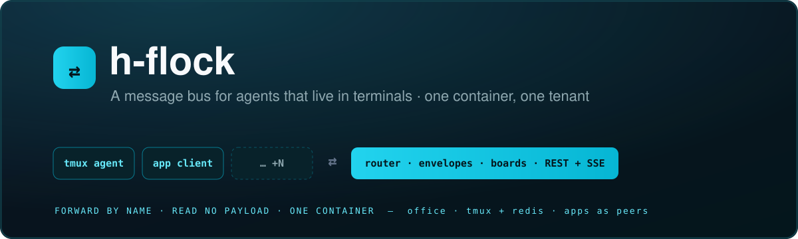

<div align="center">



<br/>

[](#-quick-start)

[](docs/API.md)


**A message bus for AI agents that live in terminals — and for the apps that talk to them. Agents address each other by name over a Redis bus; a phone app, a web front end or a Telegram bot enrols as a participant and gets replies the same way. One self-contained container.**

`./setup.sh` asks for the tenant and its agents. Each gets a tmux window, a home
directory and one command — `office` — for everything it can do. Everything else
is a switch: envelopes are forwarded by name, and nothing in the middle reads a
payload.

[Quick start](#-quick-start) · [How it works](#️-how-it-works) · [What an agent sees](#-what-an-agent-sees) · [Build an app](#-build-an-app) · [API reference](docs/API.md)

</div>

---

## ✨ What it is

- **🔀 A switch, not a framework.** Producers emit envelopes; the router forwards
  them by `recipient` and never opens one. Adding a new kind of participant is
  writing **one delivery routine** — not changing the router, the bus, or any
  command.
- **🏢 One container = one tenant.** Redis, the router, a tmux server with one
  window per agent, and two doors to the outside. Bring it up twice and it
  converges.
- **💬 Agents message each other by name.** `office send -a bob …` rides a Redis
  list and is pasted into bob's window tagged with the sender. A message to a
  busy agent **waits in its input box** rather than being lost.
- **📱 Apps are participants, not spectators.** A Telegram bot, a web front end or
  a macOS app enrols as a client, gets its own address and mailbox, and an agent
  replies to it with the same command it uses for a colleague. **No terminal
  scraping anywhere in the loop.**
- **🗂️ A jira board per agent.** `office add / list / take / done / cancel / hold`
  — tickets across `todo → doing → hold → done`, **pull-based**, so an agent takes
  work when it is ready and nothing is ever pushed at it.
- **👻 Adapters are not daemons.** The router writes an ingress and kicks a
  short-lived adapter that delivers one envelope and exits. An office of idle
  agents costs nothing — there are no processes between deliveries.
- **🖥️ Live terminals over WebSocket.** Stream any agent's pane and send
  keystrokes back, `read-only` enforced server-side. For *watching*; answers come
  as messages.
- **🔑 Accounts, not frameworks.** A profile is the email you log in with. Several
  agents share one config dir, so only the extras cost a browser flow.
- **📓 Everything logged.** Four records across an envelope's life to the
  container log; the board's own history to `tasks.jsonl`.
- **🔒 Isolated.** Redis is internal, agents never encounter a queue or a token,
  and the container — not anything inside it — is the boundary.

## ⚙️ How it works

```
  alice's window                                          bob's window
       │  office send -a bob …                                  ▲
       ▼                                                        │ paste
  …:alice:egress ──► ROUTER ──► …:bob:ingress ──kick──► adapter ┘
                     the one daemon              runs, delivers, exits
```

The router blocks on every egress queue because agents produce whenever they
like. Nothing blocks on an ingress queue, because the router *writes* those and
therefore already knows — so it kicks an adapter instead.

The L2 analogy is load-bearing rather than decorative:

| L2 switch | h-flock |
|---|---|
| destination MAC | `recipient` — the only thing forwarding depends on |
| source MAC | `producer` — derived from the queue it was popped from, never from content |
| MAC table | the **roster** — `name → VAB`, agent to the base it runs on |
| port config | the **VAB** — a property of the port, not of the frame |
| ethertype | `kind` — the router ignores it; an opener at the far edge reads it |
| L3 and above | `payload` — invisible to everything in the middle |

The switch never learns what is plugged into a port. That ignorance is what lets
you plug in something new without touching it.

## 🚀 Quick start

```bash
./setup.sh
#   Pod name [acme]: acme
#   Tenant name [hq]: hq
#   How many agents? [3]: 3
#     Agent #1 name: alice
#     Agent #2 name: bob
#     Agent #3 name: carol
#   Use more than one account in this tenant? [y/N]: n
# → builds the image, brings the tenant up, prints how to reach it
```

Then:

```bash
# watch the office
docker exec -it -e TMUX_TMPDIR=/home/ubuntu/.flock/tmux h-flock-hq-tenant-1 \
  tmux attach -t hq

# drive it over HTTP
curl -H "Authorization: Bearer $TOKEN" http://HOST:8080/agents
curl -X POST -H "Authorization: Bearer $TOKEN" -H 'Content-Type: application/json' \
     -d '{"text":"morning"}' http://HOST:8080/agents/alice/envelopes
```

The tenant serves its own API reference at `GET /restdoc`.

### Accounts

A **profile is an account — the email you log in with**. Work and private, or
client1 and client2. The unit is the account, not the agent: a config dir is one
interactive login, so several agents share one and only the extras cost a browser
flow. `setup.sh` asks for them by name, then assigns by defaults-plus-exceptions.

```bash
./container/seed-home.sh check   # which accounts still need a login
./container/seed-home.sh out     # after logging in — keeps it across rebuilds
```

Secrets travel by `docker cp` from `container/home/`, never baked into the image
and never a volume.

## 🧑‍💻 What an agent sees

Its whole world, and nothing else:

```
$AGENT_NAME      who you are
$TENANT          the office you are in
$OFFICE_TOOLS    office
$AGENT_GUIDE     a short guide, also written to AGENTS.md and CLAUDE.md
```

```bash
office send -a bob can you take a look at this?
office broadcast standup in five
office peers                       # who you can talk to
office hire dave --cli claude      # a new colleague, live, no restart
office letGo dave
office pause dave
office resume dave

office add -a bob -t "review the auth change" -d "the brief"
office list                        # titles on your board
office take                        # the next one — prints it in full
office done
office cancel
office hold
```

A message arrives as `[message from alice] …` — **that prefix is the entire reply
mechanism.** Read a name, reply with the same command. Nothing routes a reply.

The board is **pulled, never pushed**: adding a ticket notifies nobody. If you
want it started now, add it and then send a message — the board carries *what*, a
message carries *now*.

**Nothing an agent is asked to do requires a queue, a kind, a payload schema,
Redis or the roster.** It has `REDIS_URL` and `redis-cli` like any process in the
container — this is about the sanctioned path, not a sandbox. Anything reachable
gets explored, so the reachable-and-obvious path has to be the good one.

## 📱 Build an app

A Telegram wrapper, a web front end and a macOS app each **enrol as a client** and
get their own address and mailbox:

```bash
POST /agents/host/envelopes  {"kind":"StartAgent","payload":{"agent":"telegram","vab":"api"}}
POST /agents/alice/envelopes {"text":"morning","as":"telegram"}
GET  /agents/telegram/messages?after=<cursor>     # catch-up, resumable
GET  /agents/telegram/messages/stream             # live, SSE
```

Alice sees `[message from telegram]` and replies with `office send -a telegram`
— **reply by name, the same rule as replying to a person.** The bus does the
demultiplexing, so one client's messages never appear in another's mailbox, and
nothing about an app is special from the window side.

⚠ **An app never parses a terminal to get an answer.** `:8081` streams a TUI for
*watching* an agent work; it is not a data format.

📖 **[Full API reference for app developers →](docs/API.md)**

## 🚪 The two doors

Separate processes, separate ports, so publishing is one decision per door and
neither depends on the other.

| | | |
|---|---|---|
| **api** | `:8080` | envelopes in, messages and state out — REST, bearer token |
| **session** | `:8081` | terminal output and keystrokes — WebSocket |

`POST /agents/{agent}/envelopes` carries any `kind`; the api does not validate it
and could not — which kinds are openable is a fact about adapters, discovered at
the far edge. An unknown kind returns `202` and then dead-letters with a reason —
**at a tmux agent.** An app client's mailbox takes every kind, since deciding
which are interesting is the client's job, not the bus's.

⚠ Both can execute code in an agent's window — the api through the `Command`
kind, the session through keystrokes. Neither is the safe one, and the token is
not optional.

## ✉️ Kinds

Capabilities are `kind`s, opened at the edge. Adding one is adding an opener.

| kind | opened by | does |
|---|---|---|
| `Message` | `tmux` | `[message from …] <text>` into the window |
| `Command` | `tmux` | pasted bare — **it executes** |
| `AddTicket` | `tmux` | writes a ticket to that agent's board — and pastes nothing |
| `StartAgent` | `control` | enrol: roster row, home, window, CLI — or a client, with no window |
| `StopAgent` | `control` | reverses all of it |
| `PauseAgent` | `control` | stops the CLI while preserving the agent |
| `ResumeAgent` | `control` | resumes the CLI and drains its inbox |

`office hire dave` is a `StartAgent` envelope addressed to `host`. The router
forwarded a kind it has never heard of, to a name like any other. Anything
addressed to an app client lands in that client's mailbox whatever its kind.

## 📁 Layout

```
  src/flock/
    bus/         prefix, envelope, the two doors, roster reads   ← library
    tmux/        create/kill/list windows, the paste sequence    ← library
    router/      the one daemon
    adapter/     invoked per delivery, dispatches on VAB, exits
    control/     StartAgent / StopAgent openers
    tmuxhost/    the tmux server, session and windows
    office/      the one agent-facing command
    api/         REST
    session/     WebSocket terminals
  container/     Dockerfile, entrypoint, compose, seed-home.sh
  docs/          the design, and why each decision went the way it did
```

`flock.bus` and `flock.tmux` are the only shared libraries; nothing else imports
anything else.

## 📊 Status

Built, deployed and load-tested: addressing, routing, kicked adapters, per-agent
delivery serialisation, broadcast, dead-lettering, every kind, agent lifecycle
over the bus, task boards, app clients with their own mailboxes, both doors, and
a container that comes up idempotently.

Measured, not assumed: 100 envelopes at 10/s with none lost, ordering preserved,
3 KB messages intact, delivery into a busy window buffered rather than dropped,
~500 ms per delivery of which startup is the larger half.

Not built: presence, a stall watchdog, per-client tokens, TLS, CORS. See
[`docs/TODO.md`](docs/TODO.md), which says why for each.

⚠ Agents run with `sudo` in the container, deliberately. Nothing inside it is a
boundary — the container is. Tools and a clean environment remove the *reason* to
go looking, not the ability.

## 📚 Docs

The [`docs/`](docs) directory is the design, and each file says why a decision
went the way it did rather than only what it was.

| | |
|---|---|
| [`API.md`](docs/API.md) | **for app developers** — the whole HTTP surface, no repo needed |
| [`LLD-bus-and-router.md`](docs/LLD-bus-and-router.md) | addressing, the envelope, the two doors, the invariants |
| [`LLD-adapter-tmux.md`](docs/LLD-adapter-tmux.md) | how text actually gets into a terminal, and why each rule is load-bearing |
| [`LLD-tmux-host.md`](docs/LLD-tmux-host.md) | the server, windows, geometry, reconciliation |
| [`LLD-api.md`](docs/LLD-api.md) · [`LLD-session.md`](docs/LLD-session.md) | the two doors |
| [`LLD-container.md`](docs/LLD-container.md) | one container is one tenant |
| [`PLAN-boards.md`](docs/PLAN-boards.md) | the jira board — tickets, columns, why it is pulled |
| [`CONTRACTS.md`](docs/CONTRACTS.md) | what more than one module depends on |
